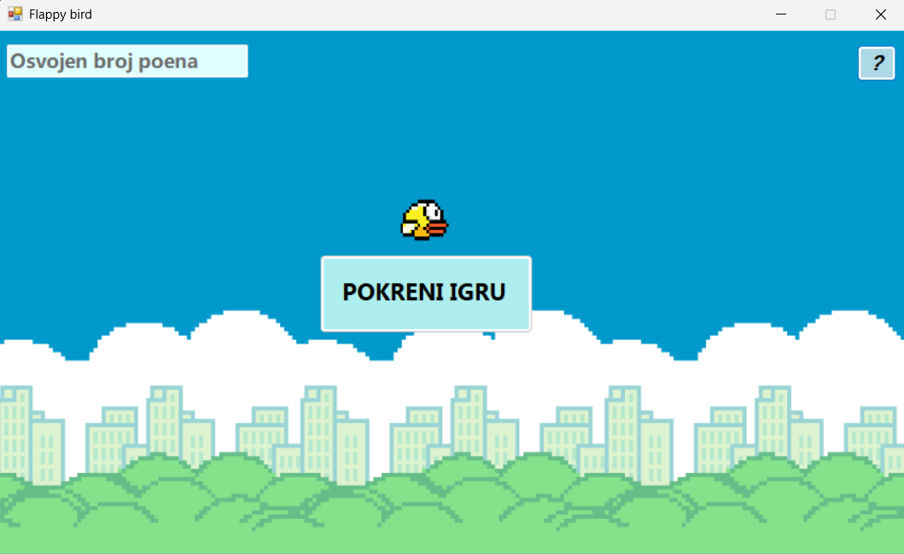
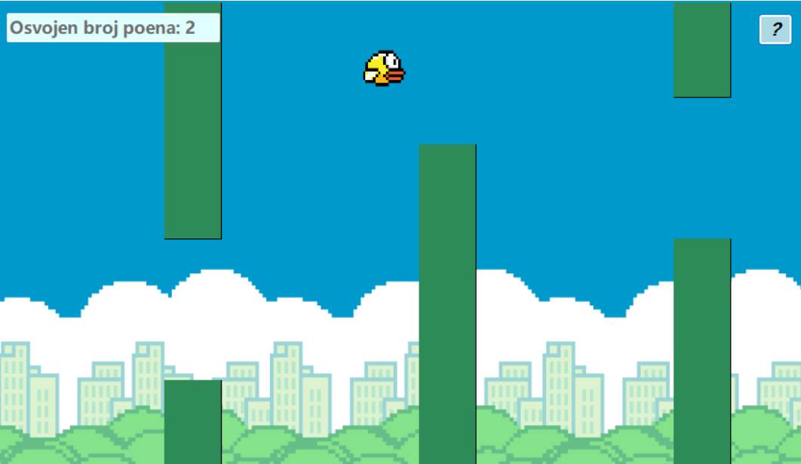

## Flappy Bird - Game made in Windows Forms 

This is a simple 2D game inspired by the classic **Flappy Bird**, developed using **C# Windows Forms**.
The player controls a bird and tries to fly through pipes without hitting obstacles. The goal is to achieve the highest possible score.

This was a school project made in 2023.

## How to Play

- Press **Space**, arrow up or click the mouse to make the bird jump
- Avoid obstacles (pipes)
- If you hit a pipe or fall → game over
- Try to get the highest score possible

## Technologies Used

- C#
- Windows Forms
- Visual Studio

## Screenshots

  
  

